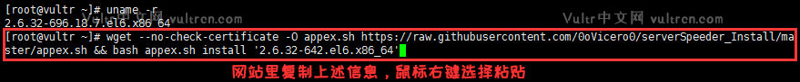
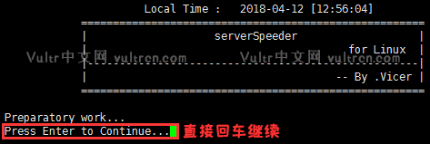
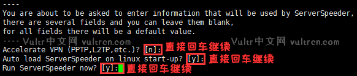
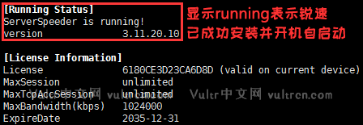

# shadowsocks
## 中文版：
```wget --no-check-certificate -O shadowsocks-libev_CN.sh https://raw.githubusercontent.com/liuyongzheng07/shadowsocks/master/shadowsocks-libev_CN.sh && bash shadowsocks-libev_CN.sh```

## 英文版：（如果中文版执行后出现乱码，那么请使用这个）  
```wget --no-check-certificate -O shadowsocks-libev.sh https://raw.githubusercontent.com/liuyongzheng07/shadowsocks/master/shadowsocks-libev.sh && bash shadowsocks-libev.sh```    

如图，回车继续    
  
中文版的基本上大家都能看得懂，输入 1 选择安装服务，回车  
  
按照下图中的提示，我们首先依次输入 SS 的各项信息，然后回车继续即可。  
PS：如果有信息输入错误需要更改时，请按住 Ctrl 键后再按删除键，直接按删除键是不能删除的。  
  
大约 2~5 分钟即可安装完成，完成后保存SS信息，就能使用了。  
  

参考：<a href="https://segmentfault.com/a/1190000015899470" target="_blank">https://segmentfault.com/a/1190000015899470</a>

# CentOS6/7 专用破解版锐速一键安装脚本  
因为 Vultr 的所有机房都位于国外，当晚上上网高峰期来临时，在连接速度上会比较慢，所以我们有必要安装一些程序来加速连接速度。本次推荐安装的是站长一直在用的锐速加速软件，个人认为目前在提速方面，相比于最新的 Google BBR 拥塞控制算法，锐速尚有优势。 

## 一、注意事项  
1、安装锐速需降级系统内核，而安装 Google BBR 则需升级系统内核，故两者不能同时安装。  

2、安装锐速需降级系统内核，有可能造成系统不稳定，故不建议将其应用在重要的生产环境中。  

3、本教程只支持 CentOS6 x64 及 CentOS7 x64 系统，不支持任何 Debian & Ubuntu 系统！ 

## 二、判断系统类型

```uname -r```  

然后回到 Xshell 软件，鼠标右键选择粘贴，回车继续。  

回车后输出当前系统内核版本。主要分三种情况：  

1、结果以 2 开头，例如 2.6.32-696.18.7.el6.x86_64。  
这种输出结果说明我们的服务器为 CentOS6 x64 系统，大家直接查看第三步进行锐速安装即可。  

2、结果以 3 开头，例如 3.10.0-693.11.6.el7.x86_64。  
这种输出结果说明我们的服务器为 CentOS7 x64 系统，大家直接查看第四步进行锐速安装即可。  

3、结果以 4 开头，例如 4.12.10-1.el7.elrepo.x86_64。  
这种输出结果说明我们的服务器已经安装 Google BBR 拥塞控制算法，此时已经无法继续安装锐速。  

## 三、CentOS6 x64 系统安装锐速  
若第二步中确定服务器为 CentOS6 x64 系统则看这一步。

按照下图提示，我们继续复制下列命令：  
```wget --no-check-certificate -O appex.sh https://raw.githubusercontent.com/liuyongzheng07/shadowsocks/master/serverSpeeder/appex.sh && bash appex.sh install '2.6.32-642.el6.x86_64'```    
然后回到 Xshell 软件，鼠标右键选择粘贴，回车继续。  
   
回车后系统会自动下载脚本并执行。按照下图提示，我们直接回车继续即可。  
   
回车继续后系统会自动安装锐速，同时会先后要求我们设置锐速的三项信息。按照下图提示，我们每次都直接回车继续即可。  
  
设置完三项信息完成后，系统会完成锐速安装并输出锐速的运行状态。按照下图提示，当出现红框内信息时说明锐速已完成安装并开机自启动。  
  

## 四、CentOS7 x64 系统安装锐速


