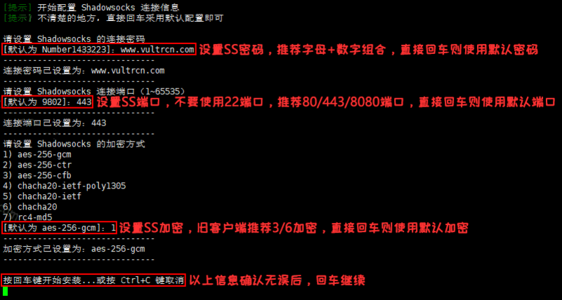

# shadowsocks
## 中文版：
```wget --no-check-certificate -O shadowsocks-libev_CN.sh https://raw.githubusercontent.com/liuyongzheng07/shadowsocks/master/shadowsocks-libev_CN.sh && bash shadowsocks-libev_CN.sh```

## 英文版：（如果中文版执行后出现乱码，那么请使用这个）  
```wget --no-check-certificate -O shadowsocks-libev.sh https://raw.githubusercontent.com/liuyongzheng07/shadowsocks/master/shadowsocks-libev.sh && bash shadowsocks-libev.sh```    

如图，回车继续    
  
中文版的基本上大家都能看得懂，输入 1 选择安装服务，回车  
  
按照下图中的提示，我们首先依次输入 SS 的各项信息，然后回车继续即可。  
PS：如果有信息输入错误需要更改时，请按住 Ctrl 键后再按删除键，直接按删除键是不能删除的。  
  
大约 2~5 分钟即可安装完成，完成后保存SS信息，就能使用了。  
  

参考：<a href="https://segmentfault.com/a/1190000015899470" target="_blank">https://segmentfault.com/a/1190000015899470</a>

